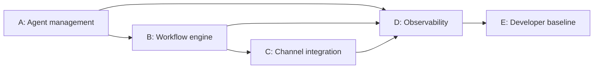

# Problem Analysis and Statement of Work

**Project:** AI Agent Orchestration Platform
**Author:** Jaidev Yadav
**Challenge:** AI Engineer Hiring Challenge — Yuno AI Team

---

## 1. Problem Statement (Verbatim)

> Build a platform where users can create AI agents, configure how they behave and operate (personality, tools, schedules, memory, limits), and connect them into collaborative workflows. Agents must run on a real runtime, execute real tools, and communicate with each other to complete tasks autonomously. At least one agent must be reachable through an external messaging channel (Discord, Telegram, or Slack) so a human can interact with it conversationally. The platform must include a web UI for managing everything visually.

---

## 2. Problem Decomposition

The problem statement breaks into four distinct concerns. Each is analysed as a design problem, not as a feature list.

### 2.1 Agent Configuration Surface
Defining *what an agent is* — identity, behavioral rules, tools, channels, memory scope, limits, guardrails. This is a configuration and persistence problem. The hard part is ensuring configured fields are actually consumed by the runtime, not stored decoratively.

### 2.2 Workflow Orchestration
Composing agents into graphs with **conditions and feedback loops**, executing them on a **real runtime**, and **passing state** between steps. The data model (nodes, edges) and the execution engine (graph traversal, state) are two sub-concerns that must stay aligned.

### 2.3 External Channel Integration
A real two-way connection to Discord: inbound trigger, outbound delivery, persisted timeline, and operator control surface. The integration must be a genuine bridge, not a mock.

### 2.4 Observability and Traceability
Every run step, runtime event, tool call, and message must be persisted and queryable. The UI must surface this so a reviewer can verify execution actually happened.

### 2.5 Note on "schedules"

The problem statement lists "schedules" as a configurable dimension alongside personality, tools, memory, and limits. In this submission:

- The agent model has a `schedule` configuration field that is stored and returned via the API.
- Scheduled (cron-style, time-triggered) execution is **not** wired to a background worker in this build. Runs are triggered manually via the UI/API or reactively via Discord ingress.
- This is a conscious tradeoff (see Section 4.6) — the demo path exercises manual and channel-triggered execution; a scheduler would add background-process complexity without changing the runtime semantics the evaluator cares about.

---

## 3. Work Bifurcation

Five parallel work streams cover the four concerns plus a developer baseline:

| Stream | Core concern | Key deliverables |
|---|---|---|
| **A — Agent management** | Define, persist, validate agent configuration | Agent CRUD API, seed system agents, UI management surface |
| **B — Workflow engine** | Model and execute multi-agent graphs with conditions | Workflow template CRUD, LangGraph runtime, sync and async run execution |
| **C — Channel integration** | Inbound and outbound Discord with persisted timeline | Webhook and bot providers, conversation model, UI control panel |
| **D — Observability** | Persist and surface run execution evidence | Run steps, runtime events, token ledger, metrics API, monitoring UI |
| **E — Developer baseline** | Reproducible local setup and verified quality | Makefile, migrations, tests for critical paths, README |

Dependency graph and execution order:

Execution order **A → B → D → C → E** reflects:

- B depends on A — workflows reference agents.
- C depends on B — inbound messages must be able to trigger runs.
- D is cross-cutting and was built incrementally alongside B and C so traces existed by the time runs were demoable.
- E was finalised last because the test suite locks in behavior across all four streams.

---

## 4. Statement of Work

### 4.1 Objective

Deliver a working, local-first AI agent orchestration platform that satisfies all functional requirements of the hiring challenge and can be demonstrated end-to-end in a single reproducible local environment.

### 4.2 Scope

**Stream A — Agent management**
- Agent model with fields: name, role, system prompt, model, tools, channels, skills, memory profile, limits, schedule config, guardrails
- Full CRUD REST API (`GET`, `POST`, `PATCH`, `DELETE`)
- System agent seeding endpoint (`POST /api/agents/seed-system/`)
- Tool and skill catalog endpoints with compatibility checks
- Agent management UI

**Stream B — Workflow engine**
- Workflow template model: nodes (agent, tools, prompt), edges (conditions, routing)
- Template CRUD API and seeding endpoint
- Sync and async run endpoints
- LangGraph execution with persisted run steps, tool traces, and artifacts
- At least two seeded templates demonstrating different workflow shapes (research/quality-review loop, support triage, blog editorial pipeline)

**Stream C — Channel integration (Discord)**
- Three provider modes: `agent_tool` (local), `webhook` (outbound), `bot` (two-way)
- Inbound message ingestion and workflow trigger
- Persisted conversation model tied to run
- Bot start/stop control API and UI panel

**Stream D — Observability**
- Persisted models: `RunStep`, `RuntimeEvent`, `InterAgentMessage`, `ApprovalTicket`, `ChannelConversation`, `TokenCostLedger`
- Metrics endpoint: `GET /api/metrics/runs?run_id={id}`
- Artifact log files per run
- Monitoring and approval views in UI

**Stream E — Developer baseline**
- Single-command setup: `make setup-full && make migrate && make run-full`
- Critical-path tests across all streams
- README with architecture diagram, API surface, setup instructions, runtime justification

### 4.3 Impact Metrics (from the brief)

The original brief lists four impact metrics. This submission addresses them as follows:

| Brief metric | How this submission addresses it |
|---|---|
| Number of configurable dimensions per agent | 10+ fields: name, role, system prompt, model, tools, channels, skills, memory profile, limits, guardrails, schedule config |
| Time from zero to a working multi-agent workflow | Three commands: `make setup-full && make migrate && make run-full`, then click Seed Defaults in UI |
| End-to-end task completion rate | Verified by `test_langgraph_workflows.py` and `test_agentic_graph_runtime.py` — seeded templates run to completion deterministically |
| Agent-to-agent message reliability | `InterAgentMessage` persistence is unit-tested in `test_message_delivery.py` |

### 4.4 Acceptance Criteria (with evidence anchors)

| Criterion | Pass condition | Evidence |
|---|---|---|
| Agent CRUD | Create, read, update, delete an agent via API and UI | `apps/agents/views.py`, `tests/test_agent_crud.py` |
| Agent configurability | All fields stored, returned via API, consumed by the runtime | `apps/agents/serializers.py`, `services/runtime/workflow_templates.py` |
| Workflow templates with conditions | At least 2 templates with conditions and feedback loops visible in UI | `services/runtime/workflow_templates.py` (seeded: `quality-review-loop`, `support-triage-policy`, plus blog pipeline) |
| Real runtime execution | A run produces persisted steps and tool traces, not simulated output | `services/runtime/langgraph_workflow.py`, `tests/test_langgraph_workflows.py` |
| Async communication and history | Agents exchange state within a run and messages are persisted | `apps/messaging/models.py`, `tests/test_message_delivery.py` |
| Discord integration | A message to Discord triggers a run; response delivered back | `services/channels/discord_bot.py`, `tests/test_discord_flow.py` |
| Monitoring | Run steps, inter-agent messages, token usage visible in UI per run | `apps/monitoring/views.py`, `GET /api/metrics/runs?run_id={id}` |
| Reproducibility | Single-command setup produces a working system | `Makefile`, `scripts/run_full.py` |
| Tests pass | `make test` is green on the critical-path suite | All files under `backend/tests/` |

### 4.5 Assumptions

- Evaluator has Python 3.11+ and Node.js 18+ installed.
- Discord credentials (webhook URL or bot token) are supplied by the evaluator for live channel testing; the platform runs without them using the `agent_tool` default.
- LLM API keys are in the environment; runtime degrades gracefully without them for seed and structural tests.
- SQLite is acceptable for local evaluation; architecture supports a clean move to PostgreSQL without structural changes.

### 4.6 Conscious Tradeoffs (Deferred Work)

These were considered and deferred deliberately, not overlooked:

| Deferred | Rationale |
|---|---|
| Scheduled (cron-style) agent execution | Schedule field is stored, but a background scheduler adds process complexity without changing the runtime semantics evaluators verify. Manual and channel-triggered runs cover the demo path. |
| Multi-tenant boundaries and RBAC | Single-evaluator demo does not exercise tenant isolation; introducing it would dilute focus on runtime correctness. |
| Production deployment hardening | Brief mandates local-first single-command setup; containerisation and TLS would contradict that. |
| Real LLM billing integration | `TokenCostLedger` records usage; billing systems are out of scope for an evaluation build. |

### 4.7 Constraints (from the brief)

- Must run fully local with a single setup command — no cloud prerequisite.
- AI framework must be one of the listed options — LangGraph chosen.
- Runtime must execute real agent logic; a UI mockup is an explicit disqualifier.
- Message history must be persisted and visible in the UI.

---

## 5. Requirement Traceability Matrix

End-to-end mapping from brief requirement to delivered evidence:

| Brief requirement | Stream | Primary code | Test | Acceptance row |
|---|---|---|---|---|
| Agent CRUD (name, role, prompt, model, tools, channels) | A | `apps/agents/views.py`, `apps/agents/models.py` | `test_agent_crud.py` | Agent CRUD |
| Agent configuration (schedules, memory, skills, rules, guardrails) | A | `apps/agents/serializers.py` | `test_agent_crud.py` | Agent configurability |
| Visual workflow builder with conditions and feedback loops | B | `apps/runs/models.py`, frontend workflow editor | `test_langgraph_workflows.py` | Workflow templates with conditions |
| At least 2 pre-built workflow templates | B | `services/runtime/workflow_templates.py` | `test_langgraph_workflows.py` | Workflow templates with conditions |
| Real runtime execution (not mockup) | B | `services/runtime/langgraph_workflow.py` | `test_agentic_graph_runtime.py` | Real runtime execution |
| Agents communicate asynchronously | B + D | `services/runtime/langgraph_workflow.py`, `apps/messaging/models.py` | `test_message_delivery.py` | Async communication and history |
| Message history persisted and visible in UI | D | `apps/messaging/models.py`, frontend messages view | `test_message_delivery.py` | Async communication and history |
| External channel (Discord/Telegram/Slack) | C | `services/channels/discord.py`, `discord_bot.py` | `test_discord_flow.py` | Discord integration |
| Live monitoring (logs, messages, token/cost) | D | `apps/monitoring/views.py`, `apps/monitoring/models.py` | — | Monitoring |
| Web UI for managing everything | A + B + C + D | `frontend/src/` | — | (cross-cut) |
| Tests for critical paths | E | `backend/tests/` | `make test` | Tests pass |
| Single setup command, fully local | E | `Makefile`, `scripts/run_full.py` | — | Reproducibility |
| README with architecture, setup, runtime justification | E | `README.md`, `docs/architecture-diagram.md` | — | (documentation weight) |

---

## 6. Risks and Mitigations

| # | Risk | Likelihood | Impact | Mitigation |
|---|---|---|---|---|
| 1 | LLM provider rate limit or outage during live demo | Medium | High | Local seed path runs without LLM; `agent_tool` Discord mode works offline; deterministic test suite proves runtime independently of provider availability |
| 2 | Discord bot session drops (token expiry, gateway disconnect) | Low | High | `bot/status` endpoint surfaces state in UI; webhook mode is a hot-swap fallback; `agent_tool` mode is a final fallback that still persists conversations |
| 3 | SQLite write contention under parallel async runs | Low | Medium | Single-process Django keeps writes serialised; SOW explicitly defers production scale; PostgreSQL migration path is documented |
| 4 | Frontend rendering inconsistency across browsers | Low | Low | Demo recorded on a known-good browser; layout is functional, not visually exotic |
| 5 | Evaluator missing Discord credentials | Medium | Low | Default `agent_tool` mode demonstrates the full flow with persisted conversations and no external dependency |

---

## 7. Glossary

| Term | Meaning |
|---|---|
| **Agent** | A configured persona with role, prompt, tools, channels, and limits, executed by the runtime as a graph node |
| **Workflow template** | A reusable graph definition (nodes + edges + conditions) that produces runs when triggered |
| **Run** | A single execution of a workflow template against an objective, with persisted steps and events |
| **RunStep** | Persisted record of one node's execution within a run, including tool I/O and status |
| **InterAgentMessage** | Persisted message produced by one agent and consumed by another within shared run state |
| **RuntimeEvent** | Persisted event emitted during run execution for monitoring and audit |
| **ChannelConversation** | Persisted timeline of messages exchanged with an external channel (Discord), linked to its triggering run |
| **ApprovalTicket** | A human-in-the-loop checkpoint that pauses a run pending operator action |
| **TokenCostLedger** | Per-call record of model token usage attached to a run for cost visibility |
| **Provider mode (Discord)** | One of `agent_tool` (local), `webhook` (outbound), `bot` (two-way) — switchable via `DISCORD_PROVIDER` |
