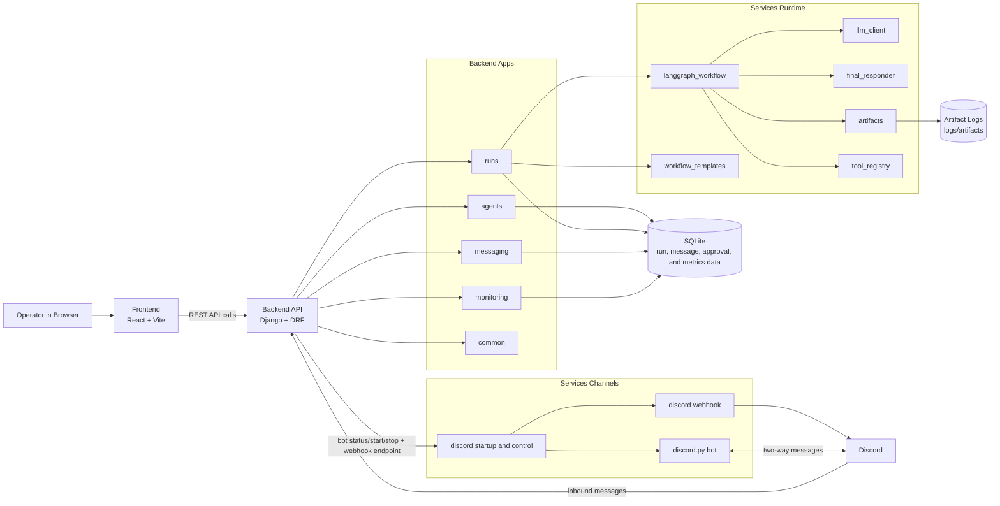

# Architecture Diagram

This diagram shows the high-level flow between the React frontend, Django API, runtime orchestration, data persistence, and Discord channel integrations.

## Notes

- Workflow execution is orchestrated through LangGraph nodes and state transitions.
- Inter-agent communication is run-state based and persisted in the database.
- Discord can operate in webhook mode or bot mode, both mediated by backend channel services.
